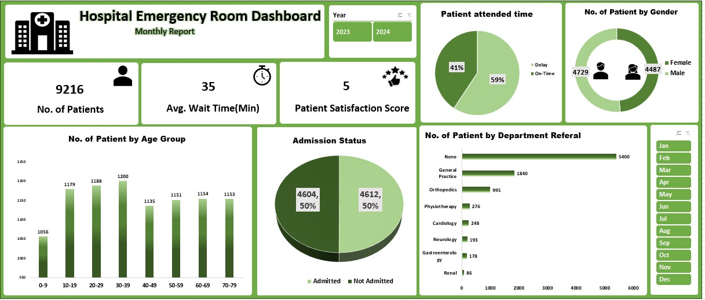

## Hospital Emergency Room Dashboard

  

#### Project Summary
In this project, I created an interactive Emergency Room Dashboard in Excel to analyze hospital data and identify key operational insights.

The main objective was to understand:

* How many patients visit the ER
* Whether patients are attended on time
* Which age group visits the most
* How many patients are admitted
* Which departments receive the most referrals

#### 🛠 What I Did

* Cleaned and structured raw hospital data in Excel
* Created **Pivot Tables** for analysis
* Built an **interactive dashboard using charts and slicers**
* Designed KPIs to track performance:
   * Total Patients
   * Average Wait Time
   * Patient Satisfaction Score
* Used filters (Year & Month) to make the dashboard dynamic

#### 📊 Key Insights I Found
###### 👥 1. Patient Volume
* Total **9,216 patients** visited the ER
👉 Shows high patient load, indicating the need for efficient management

###### ⏱ 2. Waiting Time Issue
* Average wait time is **35 minutes**
* Only **59%** patients were attended on time
* **41%** experienced delays
👉 This highlights a major operational gap in handling patients

###### 🎂 3. Age Group Trend
* Highest patients belong to **30–39** age group
* Lowest patients belong to **0–9** age group
👉 Adults are the primary users of emergency services

###### 👥 4. Gender Distribution
* Female: **4,729**
* Male: **4,487**
👉 Patient distribution is almost equal across genders

###### 🏥 5. Admission Analysis
* 50% patients were admitted
* 50% were not admitted
👉 Suggests a balanced decision-making process in ER

###### 🧑‍⚕️ 6. Department Referrals
* Most patients (5400) did not require referral
* Among referrals:
   * General Practice had the highest
   * Followed by Orthopedics
👉 Indicates that majority of cases are handled within ER itself

###### ⭐ 7. Patient Satisfaction
* Average satisfaction score is 5/10
👉 This is relatively low and may be linked to long waiting times

#### 🎯 Conclusion
From this analysis, I concluded that:
🚨 Waiting time is the biggest issue affecting patient experience
📊 ER handles most cases without referral, showing strong internal capability
👨‍👩‍👧 Adults are the primary users of emergency services
⭐ Improving efficiency can directly increase patient satisfaction

#### 🚀 Tools Used
* Microsoft Excel
* Pivot Tables
* Charts (Bar, Pie, Donut)
* Slicers for interactivity

#### 💡 What I Learned
* How to convert raw data into insights
* Dashboard design and storytelling
* Identifying business problems from data
* Presenting data in a clear and visual way

#### 📌 Future Scope
* Add more KPIs like patient turnaround time
* Improve dashboard design
* Convert this project into Power BI

#### ⭐ Support
If you found this project useful, feel free to ⭐ the repo!

